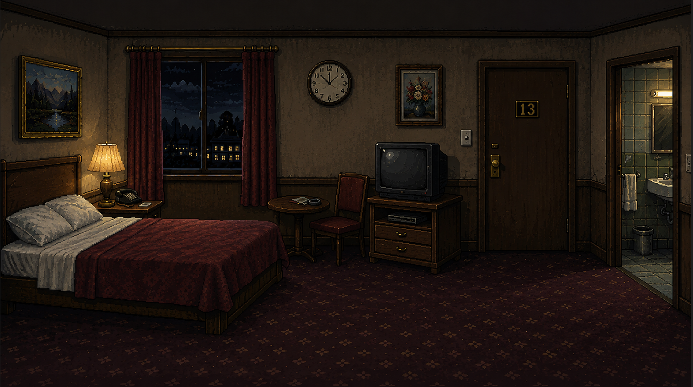

# 📹 Camera 13

**Una breve avventura grafica horror point-and-click.**

## 🎮 Gioca online

👉 **[Gioca a Camera 13](https://andreadenicola43-ops.github.io/Camera-13-/)**

## 🕯️ La storia

Ti svegli nella **Camera 13** di un vecchio hotel.

Non ricordi come sei arrivato lì.

La stanza è silenziosa, il corridoio sembra deserto e qualcosa, nel luogo,
non sembra essere come dovrebbe.

Esplorando l'hotel inizierai a trovare strani indizi che metteranno in
discussione ciò che ricordi e ciò che pensi di sapere.

Ma attenzione:

**non tutto ciò che ricordi è realmente accaduto.**

## 🖱️ Come si gioca

Camera 13 è un'avventura grafica **point-and-click**.

Utilizza i comandi:

- 👁️ **GUARDA** — osserva gli oggetti e l'ambiente
- ✋ **PRENDI** — raccogli gli oggetti
- 🔧 **USA / VAI** — utilizza gli oggetti oppure interagisci con porte e ambienti
- 🎒 **INVENTARIO** — controlla gli oggetti raccolti

Esplora attentamente e presta attenzione ai dettagli. Alcuni indizi
potrebbero assumere un significato diverso man mano che la storia procede.

## 👻 Caratteristiche

- Avventura grafica point-and-click
- Ambientazione horror
- Estetica retro ispirata ai videogiochi PC/Amiga degli anni '90
- Grafica pixel art
- Esplorazione ed enigmi
- Sistema di inventario
- Elementi narrativi e soprannaturali
- Esperienza breve, pensata per essere completata in una singola sessione

## 🛠️ Tecnologia

Il gioco è realizzato interamente con:

- HTML5
- CSS3
- JavaScript

Non richiede installazione: può essere giocato direttamente dal browser.

## 🎨 Stile

Camera 13 nasce con l'obiettivo di ricreare l'atmosfera delle vecchie
avventure grafiche horror per PC, reinterpretandola attraverso tecnologie
web moderne e un'estetica pixel art ispirata agli anni '90.

## ⚠️ Spoiler

Il gioco è pensato per essere scoperto senza conoscere in anticipo
la soluzione degli enigmi o gli eventi della storia.

**Se lo provi, evita gli spoiler prima di giocare.**

## 📜 Stato del progetto

**Completato.**

Camera 13 è un progetto indipendente realizzato come esperienza
sperimentale di sviluppo di videogiochi tramite tecnologie web.

## 💬 Feedback

Se hai giocato a Camera 13, ogni feedback è benvenuto.

In particolare:

- Quanto tempo hai impiegato per completarlo?
- Hai trovato gli enigmi intuitivi?
- Ci sono stati momenti in cui non sapevi cosa fare?
- L'atmosfera e la storia ti hanno incuriosito?

---

*Made with HTML, CSS, JavaScript and a passion for retro games. 🎮*
